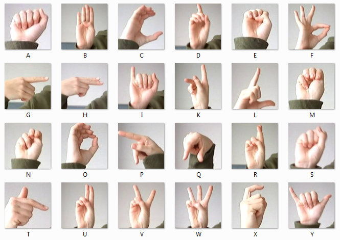
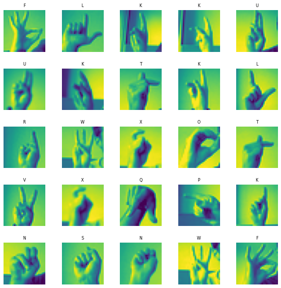
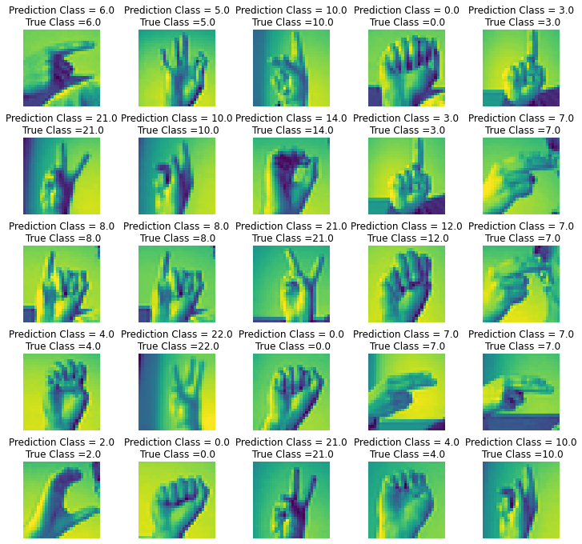

# Sign-Language-Classification

American sign language is a predominant sign language Since the only
disability D&M people have is communication related and they cannot
use spoken languages hence the only way for them to communicate is
through sign language. Communication is the process of exchange of
thoughts and messages in various ways such as speech, signals, behavior
and visuals. Deaf and dumb(D&M) people make use of their hands to
express different gestures to express their ideas with other people.
Gestures are the nonverbally exchanged messages and these gestures are
understood with vision. This nonverbal communication of deaf and dumb
people is called sign language.

# VISUALIZATION

# PREDICTION

